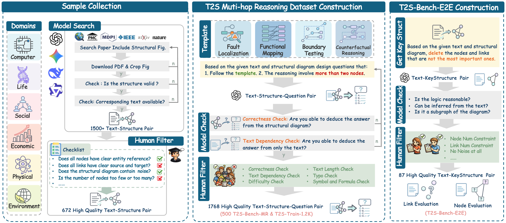

<p align="center">
    
</p>

# 🎯 T2S-Bench & Structure-of-Thought

### **Benchmarking Comprehensive Text-to-Structure Reasoning**

<p align="center">
    🌐 <a href="https://t2s-bench.github.io/T2S-Bench-Page/" target="_blank">Project Page</a> • 📚 <a href="" target="_blank">Paper</a> • 🤗 <a href="https://huggingface.co/T2SBench" target="_blank">T2S-Bench Dataset</a>
</p>
<p align="center">
    📊 <a href="https://t2s-bench.github.io/T2S-Bench-Page/#leaderboard" target="_blank">Leaderboard</a> • 🔮 <a href="https://t2s-bench.github.io/T2S-Bench-Page/#examples" target="_blank">Examples</a>
</p> 


---

## Outlines

- [🎯 About T2S-Bench](#about-t2s-bench)

- [📊 Datasets](#datasets)
- [🚀  Quick Evaluation](#quick-evaluation)
- [💪 Evaluation via lm-evaluation-harness](#evaluation-via-lm-evaluation-harness)
- [📄 Citation](#citation)

---

## About T2S-Bench

Large Language Models (LLMs) have demonstrated remarkable capabilities across a wide range of language understanding and reasoning tasks. However, their ability to **explicitly structure information** from complex text—capturing key entities, relations, and higher-order semantic organization—remains poorly understood and insufficiently evaluated.

To bridge this gap, we present **T2S-Bench**, the first benchmark specifically designed to evaluate and improve models' text-to-structure capabilities. T2S-Bench comprises **1.8K high-quality samples** spanning **6 scientific domains**, **17 subfields**, and **32 distinct structural types**, covering a wide spectrum of real-world semantic structures. Solving tasks in T2S-Bench requires models to move beyond fluent text generation and instead perform explicit semantic structuring, which proves challenging for existing models. Using T2S-Bench, we conduct a comprehensive evaluation of **45 mainstream models** across 10 model families. 

<p align="center">
    
</p>


---

## Datasets

T2S-Bench is organized into three subsets:

| Subset             |          Size | Dataset (Location)                                           | Goal                                                         | Design                                                       | Metrics                                                      |
| ------------------ | ------------: | ------------------------------------------------------------ | ------------------------------------------------------------ | ------------------------------------------------------------ | ------------------------------------------------------------ |
| **T2S-Train-1.2k** | 1,200 samples | [Hugging Face: T2SBench/T2S-Train-1.2k](https://huggingface.co/datasets/T2SBench/T2S-Train-1.2k) | Provide **verified text–structure pairs** for training / instruction tuning | Multi-hop QA; supports **single-select** & **multi-select**  | **Exact Match (EM)**, **F1**                                 |
| **T2S-Bench-MR**   |   500 samples | [Hugging Face: T2SBench/T2S-Bench-MR](https://huggingface.co/datasets/T2SBench/T2S-Bench-MR) | Answer **multi-choice** questions requiring reasoning over an **implicit/explicit structure** extracted from text | Multi-hop QA; supports **single-select** & **multi-select**  | **Exact Match (EM)**, **F1**                                 |
| **T2S-Bench-E2E**  |    87 samples | [Hugging Face: T2SBench/T2S-Bench-E2E](https://huggingface.co/datasets/T2SBench/T2S-Bench-E2E) | Extract a **node-link graph** from text that matches the target **key-structure** | Fixes key nodes/links; partially constrains generation to reduce ambiguity | **Node Similarity (SBERT-based)**, **Link F1 (connection-based)** |


## Quick Evaluation

Here we provide a simple and quick evaluation on T2S-Bench.

### Step1. Setting Environment

```bash
conda create -n t2sbench python=3.10 -y
conda activate t2sbench

git clone ### 
cd ###

pip install -r requirements.txt ###
```


### Step2. Download from Hugging Face

You can download the dataset and benchmark from Hugging Face and save locally:

```python
# Multi-hop Reasoning benchmark (500 samples)
hf download T2SBench/T2S-Bench-MR --repo-type dataset --local-dir data/T2S-Bench-MR

# End-to-End Structuring benchmark (87 samples)
hf download T2SBench/T2S-Bench-E2E --repo-type dataset --local-dir data/T2S-Bench-E2E

# Training split (1,200 samples)
hf download T2SBench/T2S-Train-1.2k --repo-type dataset --local-dir data/T2S-Train-1.2k
```

Alternatively, download benchmark splits directly with the `datasets` library:

```python
from datasets import load_dataset

# Multi-hop Reasoning benchmark (500 samples)
mr_dataset = load_dataset("T2SBench/T2S-Bench-MR")

# End-to-End Structuring benchmark (87 samples)
e2e_dataset = load_dataset("T2SBench/T2S-Bench-E2E")

# Training split (1,200 samples)
train_dataset = load_dataset("T2SBench/T2S-Train-1.2k")
```


---


### Step3. Running the Evaluations

> **Note:** Template scripts for tested models are provided in the [`scripts/`](scripts/) directory. Copy any script, update the `MODEL` variable, and run it to evaluate a new model.

#### (1) Evaluation with API

Set your API credentials as environment variables, then run `evaluate_model.py` (MR) and `evaluate_structure.py` (E2E):

```bash
export OPENAI_API_KEY="<your-key>"
export OPENAI_BASE_URL="<your-base-url>"   # omit to use the default OpenAI endpoint

MODEL="claude-haiku-4-5"
MODEL_SAFE="${MODEL##*/}"

# MR — Multi-hop Reasoning
python evaluate_model.py \
    --data_dir    data/T2S-Bench-MR \
    --model_type  api \
    --model_name  "${MODEL}" \
    --output      "results/MR/${MODEL_SAFE}.json" \
    --num_workers 8

# E2E — End-to-End Structuring
python evaluate_structure.py \
    --data_dir    data/T2S-Bench-E2E \
    --model_type  api \
    --model_name  "${MODEL}" \
    --output      "results/E2E/${MODEL_SAFE}.json" \
    --num_workers 8 \
    --resume
```

`--resume` lets you continue an interrupted E2E run without re-evaluating already-completed samples.


#### (2) Evaluation on Hugging Face model

Pass a HuggingFace model identifier (or local path) with `--model_type hf` and `--model_name_or_path`:

```bash
MODEL="meta-llama/Meta-Llama-3-8B"
MODEL_SAFE="${MODEL##*/}"

# MR — Multi-hop Reasoning
python evaluate_model.py \
    --data_dir           data/T2S-Bench-MR \
    --model_type         hf \
    --model_name_or_path "${MODEL}" \
    --output             "results/MR/${MODEL_SAFE}.json" \
    --num_workers        8

# E2E — End-to-End Structuring
python evaluate_structure.py \
    --data_dir           data/T2S-Bench-E2E \
    --model_type         hf \
    --model_name_or_path "${MODEL}" \
    --output             "results/E2E/${MODEL_SAFE}.json" \
    --num_workers        8 \
    --resume
```

Results are written to `results/MR/<model>.json` and `results/E2E/<model>.json` respectively.

---


## Evaluation via lm-evaluation-harness

T2S-Bench is also supported through [EleutherAI's lm-evaluation-harness](https://github.com/EleutherAI/lm-evaluation-harness), allowing standardized evaluation of HuggingFace models using the `lm_eval` CLI.

### Step1. Setup

Install the harness from the included fork:

```bash
cd lm-evaluation-harness
pip install -e .
pip install sentence-transformers   # required for structure evaluation
```

The T2S-Bench is written in the task below

| Task name | Track | Description |
|---|---|---|
| `t2sbench_multichoice` | MR | Multi-choice QA over scientific text (EM & F1) |
| `t2sbench_structure_nodes` | E2E | Node labeling stage (SBERT node similarity) |
| `t2sbench_structure_links` | E2E | Link extraction stage (Link F1) |
| `t2sbench` | Both | Full benchmark (all three tasks) |


### Step2. Running Evaluations

**HuggingFace local model:**

```bash
CUDA_VISIBLE_DEVICES=1 lm_eval --model vllm \
  --model_args pretrained=Qwen/Qwen3-8B,trust_remote_code=True,tensor_parallel_size=1,dtype=auto,gpu_memory_utilization=0.8 \
  --tasks t2sbench \
  --batch_size auto \
  --apply_chat_template
```

**OpenAI-compatible API (e.g. vLLM, local server, or OpenAI):**

```bash
export OPENAI_API_KEY="<your-key>"

lm_eval --model local-chat-completions \
  --model_args model="gpt-4o-mini",base_url="https://api.openai.com/v1" \
  --tasks t2sbench \
  --batch_size 1 \
  --apply_chat_template
```

**Output Format**

All evaluation scripts write a JSON file with the following structure:

```json
{
  "overall": {
    "em": 0.521,
    "f1": 0.563,
    "num_samples": 500
  },
  "by_major_class": {
    "CS": { "em": 0.55, "f1": 0.59, "num_samples": 80 },
    "Life-Science": { "em": 0.50, "f1": 0.54, "num_samples": 90 }
  },
  "by_question_type": {
    "single": { "em": 0.61, "f1": 0.61, "num_samples": 300 },
    "multi": { "em": 0.37, "f1": 0.50, "num_samples": 200 }
  },
  "all_samples": [
    {
      "sample_name": "CS_Networks_001",
      "major_class": "CS",
      "minor_class": "CS_Networks",
      "question_type": "single",
      "gold_answer": ["B"],
      "pred_answer": ["B"],
      "em": 1.0,
      "f1": 1.0,
      "response": "..."
    }
  ]
}
```

For E2E structure evaluation, the output additionally includes `node_similarity` and `link_f1` fields per sample.

---

## Citation

If you find **T2S-Bench** useful for your research and applications, please cite:

```bibtex
@inproceedings{
}
```
